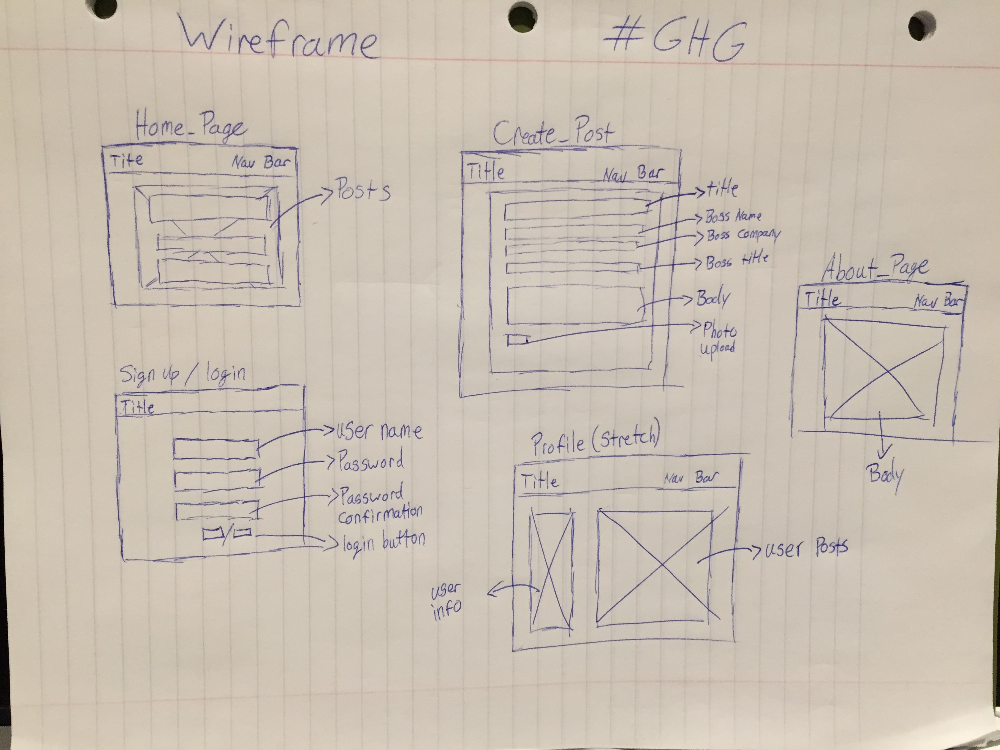
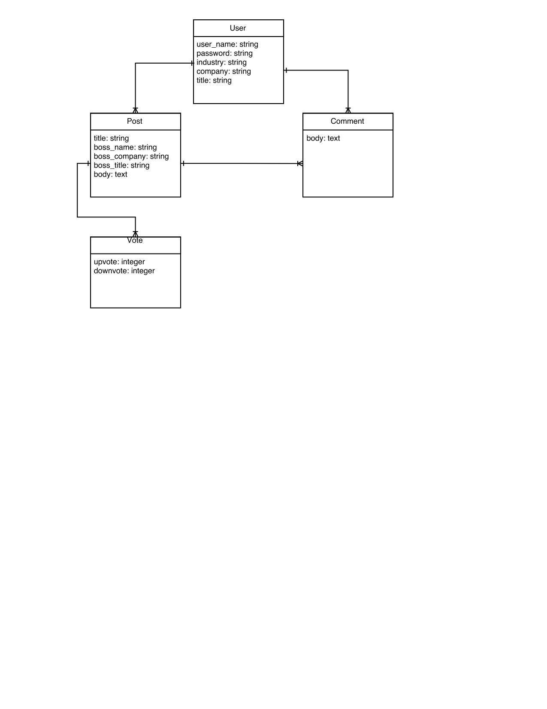

#Gossip Hollywood Gurl #GHG

####DESCRIPTION

Coffee's not hot enough? Welcome to Hollywood!

Introducing Gossip Hollywood Gurl! This is a site to share your assistant job happenings in the entertainment industry! (but we all know that you're still an unpaid intern).

Create a profile and post your horrific stories to share with the world and other users in your industry. You may find another post of your boss from a past job that may give you infinite joy. Maybe add a comment to that post to just affirm how bad the person is (or nice ☺️)!

###APPROACH TAKEN
Started with creating the wireframe, ERD, and Trello board to help organize and kick off my project. I then went after my MVP of creating a User and Post model and schema. After accomplishing the MVP requirements for a full functioning secure login and CRUD capabilities on posts, I then added two more tables for voting and comments. After accomplishing those stretch goals I then styled the site using bootstrap.

###INSTALLATION INSTRUCTIONS
<ol>
<li>Clone Repository</li>
<li>Rails create to put repository in new folder</li>
<li>Open terminal</li>
<li>install bundle</li>
<li>rails db:migrate</li>
<li>rails s</li>
<li>go to localhost:3000 in your web browser</li>
</ol>

###TECHNOLOGIES USED
<ul>
<li>HTML</li>
<li>CSS</li>
<li>SCSS</li>
<li>Ruby on Rails</li>
<li>Bootstrap</li>
<li>Heroku</li>
<li>PostgreSQL</li>
<li>Philippe</li>
</ul>

###Known Bugs/Unsolved Problems
<li>When on the show page for a post, it will still give you a log in alert when you vote even if you are already logged in</li>
<li>Couldn't get a background image to render for the about page via scss</li>
<li>Get the update profile to change username/email/password etc...</li>
<li>Using Ajax to make buttons render more smoothly</li>
<li>Fix "/edit" bug for editing a post</li>

###<a href="https://trello.com/b/X3rNmUG5/project-2-gossip-hollywood-gurl">Trello Board</a>

